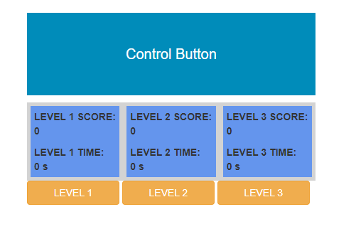
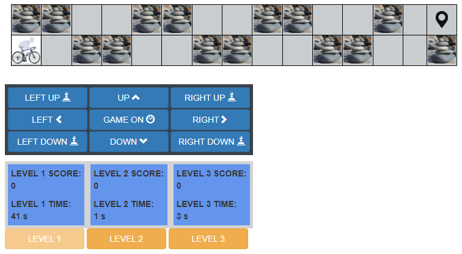
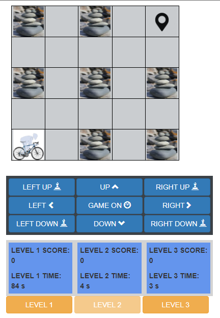
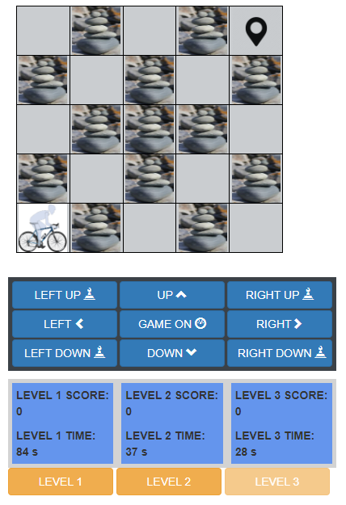
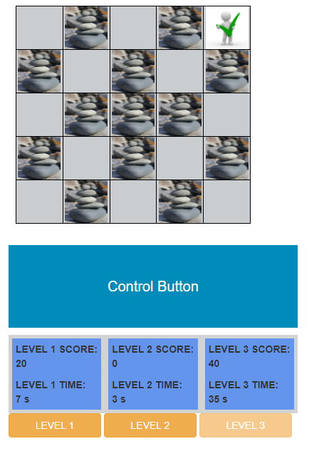
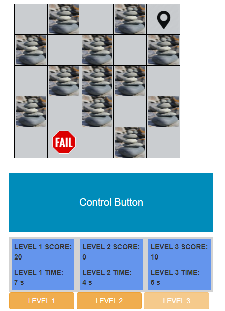

# hurdle_game

1. Their is three path with hurdles
2. Run through path using on screen button click and keyboard keys
3. Keys :  up -> UpArrow key , Down -> DownArrow Key , Left -> LeftArrow key , Right -> RightArrow Key , leftUp -> 'Q', rightUp -> 'E', leftDown -> 'A' , rightDown ->'D'
4. Play for fun

## How to start 
    1. Run npm install
    2. npm start
    3. Open the website
        http://localhost:8080/
        Note: Default port is set to 8080

## Home Page
  

## Level 1
 

 
## Level 2
  

## Level 3
 

 
## Success
  

## Failure
 